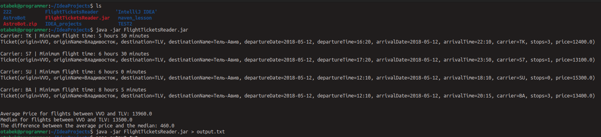
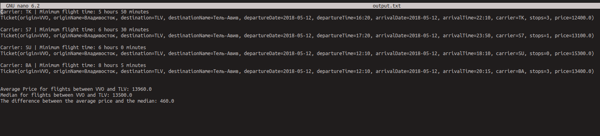

# Flight Tickets Reader

This is a Java application for analyzing flight data. The program reads information about tickets from the `tickets.json` file and then performs various analyses, such as calculating the minimum flight time for each carrier and determining the difference between the average price and the median for flights between Vladivostok and Tel Aviv.

## How to Use

1. Download the `FlightTicketsReader.jar` file from the repository.
2. Make sure the `tickets.json` file is in the same directory as `FlightTicketsReader.jar`.
3. Open a terminal and navigate to the directory where `FlightTicketsReader.jar` is located.
4. Run the following command to start the application:

## Results

### Example Output:

### Analysis Results:

- Minimum flight time for each carrier:
- Carrier: TK | Minimum flight time: 5 hours 50 minutes
- Carrier: S7 | Minimum flight time: 5 hours 30 minutes
- Carrier: SU | Minimum flight time: 6 hours 15 minutes
- Carrier: BA | Minimum flight time: 8 hours 5 minutes

- Average price for flights between Vladivostok and Tel Aviv: 13862.5
- Median for flights between Vladivostok and Tel Aviv: 13550.0
- Difference between the average price and the median: 312.5

## Requirements

- Java Runtime Environment (JRE) version 8 or higher.

  
